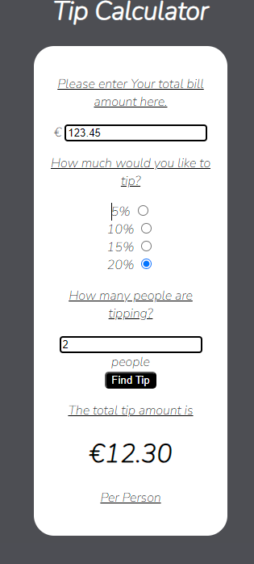

# Tip Calculator

For this project, I decided to create a website that would allow you to calculate how much a tip will come to. It also serves the purpose of showing how JavaScript can be used to create a simple website and can be used to process user inputs.

On this site, it's asks the user to input their bill amount, select what percentage they want to tip by and selecting whether one person or multiple people are tipping. Once the user click the button on the bottom of the page, the amount the user can tip will appear at the bottom. It will display the tip per person in the case of multiple people tipping.

## Features

- Heading
    - A simple H1 heading, clearly outlineing what the purpose of the website is.

- User Input Area
    - An area where the user can enter all the info the website needs to calculate the tip amount and to submit it.

- Tip Amount Shown
    - Finally, an area where the final tip amount is shown. This area only appears after the user has submitted the data above.

## Testing 

In order to ensure that all relevant data was being received within the script.js file, I began with simply logging the necessary data within the console. Once I had all the relevant data, it was then a case of passing this data to the calculateTip function and ensuring I had a function website.

The next stage was to add error checking within the function to ensure that the user was entering valid data and to alert the user if otherwise. This was achieved by adding several if and if else statement to the calculateTip function ensuring all entered data was valid.

It was then time to validate the code itself.

- HTML
    - No errors were returned when passing through the official [W3C validator](https://validator.w3.org/)

- CSS
    - No errors were found when passing through the official [(Jigsaw) validator](https://jigsaw.w3.org/css-validator/)

- JavaScript
    - No errors were found when passing through the official [Jshint validator](https://jshint.com/)
    - The following info was returned. 
        - There are 3 functions in this file.
        - Function with the largest signature take 1 arguments, while the median is 0.
        - Largest function has 23 statements in it, while the median is 1.
        - The most complex function has a cyclomatic complexity value of 9 while the median is 1.

## Deployment 
 
 The following process was used to deploy the programme via [GitHub](https://github.com/)

 - Navigate to settings, then pages
 - Select main from the branches tab and click save 
 - The page will then be updated to provide you with the link for the webpage

 